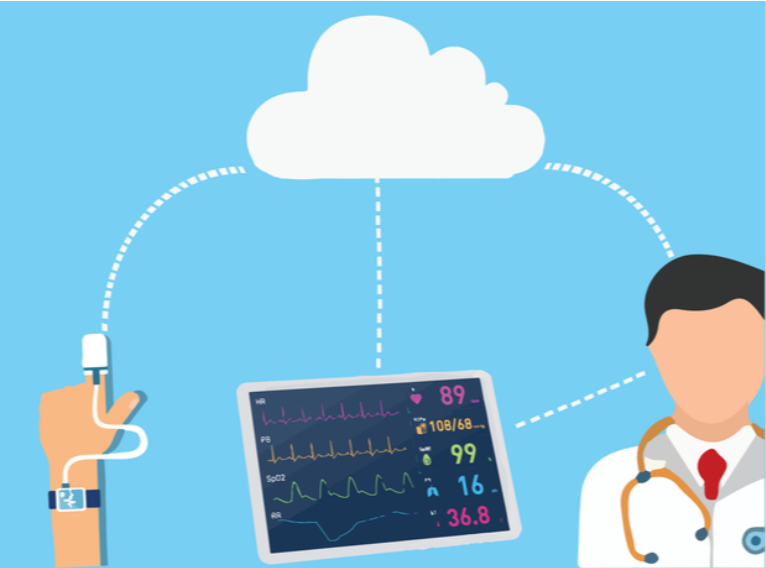
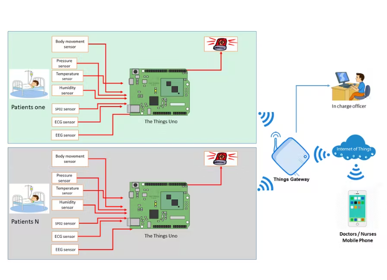
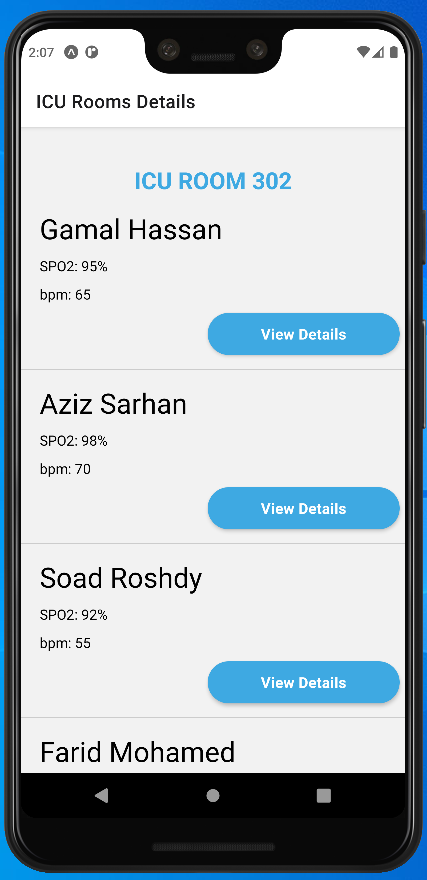
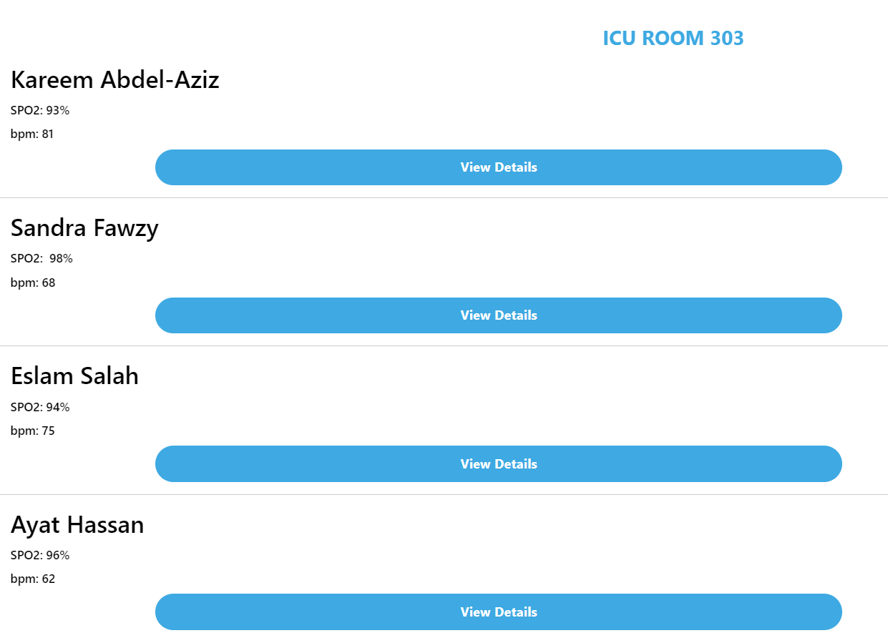
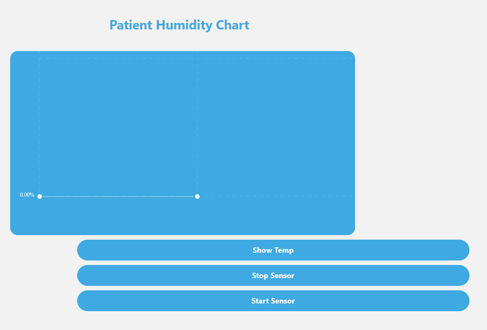
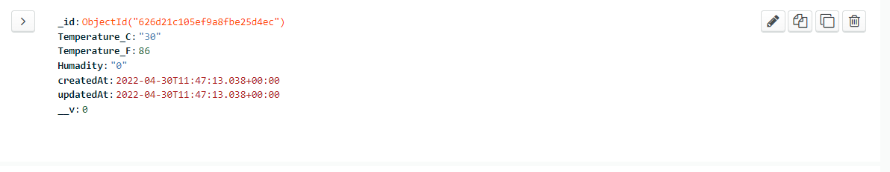

# IOT-Based-ICU-Patient-Monitoring-System
It is a system that collects patient information with the help of a few sensors using WiFi module to keep the Doctors updated all time over internet

<p align="center"></p>

* ## Requirements 
    * ### Hardware Specifications
        1. ESP8266 NodeMCU
        2. Temperature Sensor
        3. Humadity Sensor

    * ### Software Specifications
        1. Arduino IDE
        2. Node Modules (Client_Side)[📎](https://github.com/Radwa-Saeed/IOT-Based-ICU-Patient-Monitoring-System/blob/main/client/Readme.md)
        3. Node Modules (Server_Side)[📎](https://github.com/Radwa-Saeed/IOT-Based-ICU-Patient-Monitoring-System/blob/main/server/Readme.md)
        4. Mongo Atlas acc (Optional)

<h2> Contents </h2>

1.  [Introduction](https://github.com/Radwa-Saeed/IOT-Based-ICU-Patient-Monitoring-System#1-introduction)
2.  [User Interface](https://github.com/Radwa-Saeed/IOT-Based-ICU-Patient-Monitoring-System#2-user-interface)
3.  [App Features](https://github.com/Radwa-Saeed/IOT-Based-ICU-Patient-Monitoring-System#3-app-features)
4.  [Server](https://github.com/Radwa-Saeed/IOT-Based-ICU-Patient-Monitoring-System#4-server)

## 1. Introduction 
- Intensive Care Unit or ICU is where the patients who are critically ill are admitted for treatment. For such critical conditions the Doctors need to have an all-time update patient’s health related parameters like their blood pressure, heart pulse and temperature. 

<p align="center"></p>

* So we have designed a system that monitors the health related parameters of each patient in each room through some sensors and transmit these parameters values to the server so that doctors can keep up with each case.

## 2. User Interface

<p align="center"></p>

## 3. App Features

* Here the user can choose the patient to view his/her health datails from any specific room
 
<p align="center"></p>

* In the details section, the user can control each sensor to turn it on or off. and also he can visualize values variability through the time chart

<p align="center"></p>


## 4. Server
* Here is a Data Base Sample from MongoAtlas 

<p align="center"></p>

* ## Important Note 
    - Make sure to replace the IP address in each file with yours 
    - you can find your ipv4 address by the following in your cmd 
    ```
    >> ipconfig 
    ```


